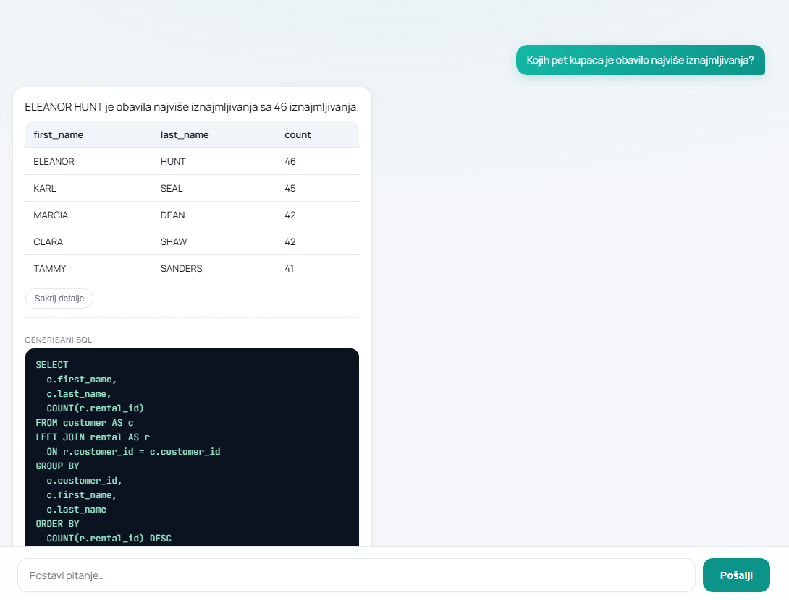
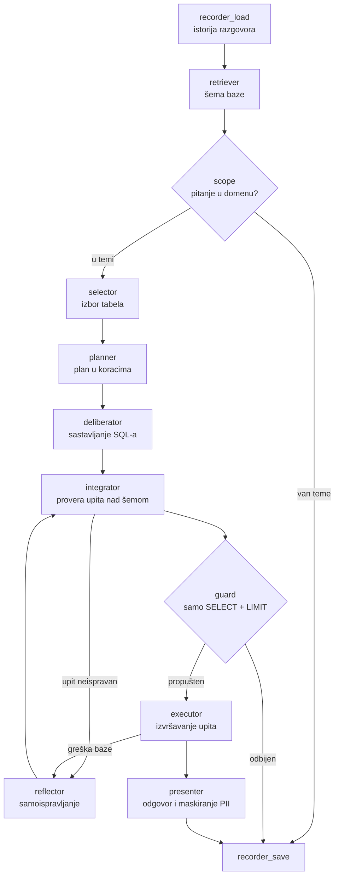

# text2sql


Višeagentski sistem koji pitanje na prirodnom jeziku prevodi u SQL upit,
izvršava ga nad bazom i rezultat prikazuje korisniku u obliku tabele i
tekstualnog sažetka. Sistem demonstrira 12 agentnih dizajn paterna
sistemsko-teorijskog okvira, a doprinos svakog paterna izmeren je ablacionom
studijom. Praktični deo diplomskog rada na Fakultetu tehničkih nauka u Novom
Sadu.



## Arhitektura

Tri sloja sa jasno razdvojenim odgovornostima: korisnički interfejs, agentni
sloj organizovan kao graf specijalizovanih čvorova i baza podataka dostupna
isključivo za čitanje.



Svaki čvor realizuje po jedan dizajn patern; mapa paterna na module je u
[docs/pattern-map.md](docs/pattern-map.md), a primer kompletnog traga
izvršavanja u [docs/trace-primer.md](docs/trace-primer.md).

## Tehnologije

| Sloj | Tehnologija |
|---|---|
| Agentni sloj | Python 3.12, LangGraph, LangChain |
| Veb servis | FastAPI + Uvicorn |
| Baza podataka | PostgreSQL 16 (Docker), demo baza Pagila, psycopg |
| Bezbednosna provera upita | sqlglot (analiza strukture upita) |
| Korisnički interfejs | Next.js 14, React 18, TypeScript |
| Jezički model | gpt-4o-mini preko OpenRouter-a (podržani i Groq, Gemini, Anthropic) |

## Pokretanje

Preduslovi: Python 3.12, Docker, Node.js 22 + pnpm, OpenRouter API ključ.

```powershell
# 1. virtuelno okruzenje + zavisnosti
python -m venv .venv
.\.venv\Scripts\Activate.ps1
pip install -r requirements.txt

# 2. baza (PostgreSQL u Docker-u, host port 5433)
docker compose up -d

# 3. ucitavanje baze Pagila
docker exec text2sql-postgres psql -U t2s_admin -d text2sql -c "CREATE DATABASE pagila;"
type db\pagila\pagila-schema.sql | docker exec -i text2sql-postgres psql -U t2s_admin -d pagila
type db\pagila\pagila-data.sql | docker exec -i text2sql-postgres psql -U t2s_admin -d pagila
docker exec text2sql-postgres psql -U t2s_admin -d pagila -c "GRANT CONNECT ON DATABASE pagila TO t2s_readonly; GRANT USAGE ON SCHEMA public TO t2s_readonly; GRANT SELECT ON ALL TABLES IN SCHEMA public TO t2s_readonly;"

# 4. konfiguracija
copy .env.example .env
# popuniti OPENROUTER_API_KEY u .env

# 5. frontend zavisnosti
cd web
pnpm install
cd ..
```

Pokretanje (dva terminala, baza mora da radi):

```powershell
# Terminal 1 - backend, iz korena projekta, venv aktivan
python -m agent.server        # http://localhost:8000

# Terminal 2 - frontend
cd web
pnpm dev                      # http://localhost:3000
```

## Bezbednost

Četiri sloja zaštite:

1. nalog i konekcija sa isključivo pravom čitanja — izmena podataka je
   nemoguća na nivou baze,
2. analiza strukture upita (sqlglot): propušta se isključivo jedan SELECT
   iskaz uz automatski LIMIT,
3. maskiranje ličnih podataka u prikazu rezultata,
4. provera teme na ulazu — odbijanje pitanja van domena i pokušaja
   ubacivanja uputstava.

Slojevi 1–3 su deterministički i ne zavise od jezičkog modela.

## Evaluacija

```powershell
python -m eval.evaluate              # EX + bezbednost, pun sistem
python -m eval.run_ablation          # ablaciona studija (12 konfiguracija)
python -m eval.run_ablation_additive # doprinos po jednog paterna nad polaznim resenjem
python -m eval.run_ablation_hard     # ablacija na tezim pitanjima
python -m eval.stability             # stabilnost (3 ponavljanja)
python -m eval.make_charts           # grafikoni iz rezultata
python -m eval.make_report           # eval/REZULTATI.md — sva merenja po pitanju
```

Skupovi pitanja: `eval/gold_set.json` (24 pitanja sa poznatim tačnim
odgovorima), `eval/gold_hard.json` (10 težih pitanja),
`eval/attacks.json` (10 napada). Rezultati merenja su u
`eval/results_*.json`, a čitljiv pregled svih merenja — po pitanju, sa
SQL-om koji je sistem izvršio — u [eval/REZULTATI.md](eval/REZULTATI.md).

## Rezultati

| Konfiguracija | Tačnost (EX) | Blokirani napadi |
|---|---|---|
| Pun sistem (gpt-4o-mini) | **100 %** (24/24) | 9/10 |
| Pun sistem, teža pitanja | 70 % (7/10) | — |
| Bez ijednog paterna (jedan poziv modela) | 4 % (1/24) | 50 % |

Tačnost punog sistema potpuno je postojana kroz tri ponovljena merenja.
Poređenje sa slabijim modelom (llama-3.1-8b) pokazuje znatno nižu tačnost
koja osetno varira po konfiguracijama, bez doslednog doprinosa pojedinačnih
paterna, dok bezbednosni paterni doprinose nezavisno od modela.

## Struktura projekta

```text
text2sql/
├── agent/          agentni sloj (LangGraph graf, čvorovi = paterni, LLM, DB)
│   ├── nodes/      čvorovi grafa
│   └── db/         veza sa bazom i opis šeme
├── web/            korisnički interfejs (Next.js + TypeScript)
├── db/             Docker init (read-only nalog) i Pagila SQL
├── eval/           merenje tačnosti (EX), bezbednosti, ablacija, grafikoni
└── docs/           mapa paterna i primer traga izvršavanja
```

## Autor

Lea Sušić — diplomski rad, Fakultet tehničkih nauka, Univerzitet u Novom Sadu,
2026.
